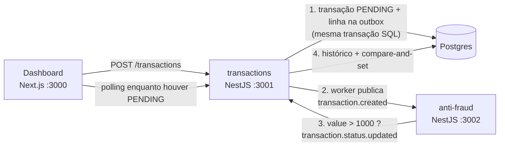

# Transações com validação antifraude assíncrona

Monorepo com dois serviços NestJS e um dashboard Next.js. Uma transação nasce `pendente`,
é avaliada por um serviço antifraude **fora do ciclo da requisição** e tem o status
atualizado depois. A comunicação entre os serviços é por Kafka; o dashboard vê a mudança
acontecer sem recarregar a página.

Regra do domínio: valor **acima de** 1000 é rejeitado. 1000 exato é aprovado.

- [Arquitetura](#arquitetura)
- [O que tem no repositório](#o-que-tem-no-repositório)
- [Pré-requisitos](#pré-requisitos)
- [Subindo do zero](#subindo-do-zero)
- [Vendo o fluxo fechar](#vendo-o-fluxo-fechar)
- [API](#api)
- [Eventos](#eventos)
- [Testes e quality gate](#testes-e-quality-gate)
- [O que ficou de fora, e por quê](#o-que-ficou-de-fora-e-por-quê)

---

## Arquitetura



A imagem mental em quatro passos:

1. **A criação não espera nada.** O `POST /transactions` grava a transação como `PENDING`
   **e** a mensagem de evento na tabela `outbox_messages`, **na mesma transação do
   Postgres**. Responde `201` e acabou. Nenhuma chamada de rede acontece no caminho da
   requisição — se o Kafka estiver fora do ar, a criação continua funcionando.
2. **Um worker leva a mensagem para o Kafka.** A cada segundo ele varre as linhas da outbox
   sem `published_at`, publica no tópico `transaction.created` usando o id da transação como
   chave de partição, e marca a linha como publicada. É isso que evita o _dual write_:
   escrever no banco e no broker sem transação comum deixaria transação nunca validada ou
   evento sobre transação inexistente.
3. **O antifraude é stateless.** Não tem banco, não tem Prisma, não lê a tabela de
   transações. Recebe o valor no payload, aplica a regra e publica
   `transaction.status.updated`. O valor trafega como string decimal (`"1000.00"`) para que a
   comparação de fronteira não dependa de ponto flutuante.
4. **O resultado volta e é aplicado de forma idempotente.** O serviço de transações consome
   o resultado e, numa única transação: insere a linha no log append-only
   `transaction_status_history` (o índice único `[transaction_id, event_id]` absorve
   reentrega do Kafka) e faz `UPDATE ... WHERE id = ? AND status = 'PENDING'` —
   compare-and-set, nunca `SELECT` seguido de `UPDATE`.

No dashboard, a transação aparece `pendente` e muda sozinha: o refetch fica ativo **apenas
enquanto houver alguma transação `PENDING` na tela**, e se desliga sozinho quando não houver
mais nenhuma.

O porquê de cada uma dessas escolhas — e o que estava na mesa junto — está no
[DECISIONS.md](./DECISIONS.md).

### Estrutura

```
apps/
├── transactions/   API HTTP + consumidor do resultado + worker da outbox. Dono do banco.
├── anti-fraud/     consumidor da criação. Stateless: sem banco, sem Prisma.
└── web/            dashboard Next.js (App Router) + Tailwind
packages/
├── contracts/      schemas Zod dos eventos e dos contratos HTTP, compartilhados
└── messaging/      fiação do Kafka: produtor, criação de tópicos, Clock e IdGenerator
```

Dentro de cada feature dos dois serviços a árvore mostra a fronteira que importa:

```
domain/        tipos, erros e portas. Zero framework.
application/   casos de uso puros, com os testes ao lado.
adapters/      HTTP, Kafka e Prisma. Controllers e handlers são finos.
```

## O que tem no repositório

| Camada      | Tecnologia                                       |
| ----------- | ------------------------------------------------ |
| Runtime     | Node.js 22                                       |
| Pacotes     | pnpm workspaces, sem orquestrador de build       |
| Backend     | NestJS + TypeScript estrito                      |
| ORM / banco | Prisma 7 + PostgreSQL 16                         |
| Mensageria  | Kafka, pelo transporte de microserviço do NestJS |
| Frontend    | Next.js 16 (App Router) + React 19 + Tailwind 4  |
| Validação   | Zod, do corpo HTTP ao payload do evento          |
| Testes      | Vitest nos três apps e nos dois pacotes          |

## Pré-requisitos

- **Node.js 22** (o `.nvmrc` fixa a versão: `nvm use`)
- **pnpm** — se não tiver: `corepack enable && corepack prepare pnpm@latest --activate`
- **Docker** com Compose, para o Postgres, o Kafka e o Kafka UI

Nada mais precisa estar instalado na máquina. Postgres e Kafka sobem em container.

## Subindo do zero

Quatro comandos, na ordem:

```bash
cp .env.example .env     # 1. variáveis de ambiente (um único .env, na raiz)
docker compose up -d     # 2. Postgres, Kafka e Kafka UI
pnpm setup               # 3. instala, constrói os pacotes, migra e popula o banco
pnpm dev                 # 4. sobe os três apps
```

O que cada passo faz:

1. **`.env`** — existe um só, na raiz, e os três apps leem dele. As portas padrão são 3000
   (dashboard), 3001 (transações) e 3002 (antifraude). Os dois serviços Nest validam as
   variáveis com Zod no boot: faltando alguma, o processo falha na subida dizendo o nome do
   que faltou, em vez de quebrar no primeiro request.
2. **`docker compose up -d`** — espere os containers ficarem saudáveis (`docker compose ps`).
   O Postgres responde em `localhost:5432`, o Kafka em `localhost:9092`, e o Kafka UI abre
   em <http://localhost:8080>.
3. **`pnpm setup`** — instala as dependências, gera o client do Prisma, constrói
   `packages/contracts` e `packages/messaging` (os apps os consomem pelo `dist`), aplica as
   migrations e roda o seed dos tipos de transferência. O seed é idempotente: rodar de novo
   num banco populado não duplica nada.
4. **`pnpm dev`** — sobe os três apps em paralelo, num único terminal, com a saída prefixada
   pelo nome do pacote. Os tópicos do Kafka são criados pela própria aplicação no arranque,
   com o número certo de partições.

Depois disso:

| Serviço    | Endereço                                    |
| ---------- | ------------------------------------------- |
| Dashboard  | <http://localhost:3000>                     |
| API        | <http://localhost:3001> (health: `/health`) |
| Antifraude | <http://localhost:3002> (health: `/health`) |
| Kafka UI   | <http://localhost:8080>                     |

Comandos avulsos, quando você já subiu uma vez:

```bash
pnpm --filter @challenge/transactions db:migrate   # aplicar migration nova
pnpm --filter @challenge/transactions db:seed      # repopular os tipos de transferência
pnpm --filter @challenge/web dev                   # subir um app só
```

## Vendo o fluxo fechar

```bash
# aprovada: 500 está abaixo do limite
curl -s -X POST http://localhost:3001/transactions \
  -H 'content-type: application/json' \
  -d '{
    "accountExternalIdDebit": "3fa85f64-5717-4562-b3fc-2c963f66afa6",
    "accountExternalIdCredit": "0b6b1a1e-6bd3-4c0d-9b40-2c0f6f4a2b71",
    "transferTypeId": 1,
    "value": 500
  }'
```

A resposta sai imediatamente com `"transactionStatus": { "name": "pending" }`. Consultando o
mesmo id um instante depois:

```bash
curl -s http://localhost:3001/transactions/<transactionExternalId>
```

o status já é `approved`. Repetindo com `"value": 5000`, vira `rejected`. Com `"value": 1000`
exato, **aprova** — o limite é `>`, não `>=`.

Pelo dashboard, o mesmo caminho: <http://localhost:3000/transactions/nova> cria a transação,
ela aparece na listagem como `pendente` e muda de status na tela, sem recarregar.

No Kafka UI dá para ver os dois tópicos, as mensagens em cada um e o lag dos dois consumer
groups.

## API

### `POST /transactions` → `201`

```json
{
  "accountExternalIdDebit": "Guid",
  "accountExternalIdCredit": "Guid",
  "transferTypeId": 1,
  "value": 120
}
```

Responde no formato de leitura, com `transactionStatus.name` igual a `pending`. Corpo
inválido devolve `400` com a mensagem por campo, em português. `transferTypeId` inexistente
também é `400`.

### `GET /transactions/:transactionExternalId` → `200` | `404`

```json
{
  "transactionExternalId": "Guid",
  "transactionType": { "name": "Transferência entre contas" },
  "transactionStatus": { "name": "approved" },
  "value": 120,
  "createdAt": "2026-08-19T12:00:00.000Z"
}
```

Id malformado é `400` (erro do cliente); id válido que não existe é `404`.

### `GET /transactions` → `200`

Listagem paginada, ordenada por `createdAt` decrescente com desempate por `id`.

| Query            | Tipo                                  | Padrão |
| ---------------- | ------------------------------------- | ------ |
| `status`         | `pending` \| `approved` \| `rejected` | —      |
| `transferTypeId` | inteiro positivo                      | —      |
| `from`, `to`     | instante ISO **com fuso**             | —      |
| `page`           | inteiro, teto de 1000                 | `1`    |
| `pageSize`       | inteiro, teto de 100                  | `20`   |

```json
{
  "items": ["... transações no formato de leitura ..."],
  "pagination": { "page": 1, "pageSize": 20, "total": 42, "totalPages": 3 }
}
```

A query é estrita: chave desconhecida é `400`, e não filtro descartado em silêncio —
`transferType` no lugar de `transferTypeId` devolveria a lista inteira sem ninguém perceber.
`from` posterior a `to` também é `400`.

## Eventos

| Evento                       | Publicado por  | Consumido por  |
| ---------------------------- | -------------- | -------------- |
| `transaction.created`        | `transactions` | `anti-fraud`   |
| `transaction.status.updated` | `anti-fraud`   | `transactions` |

Nome do tópico e nome do evento são a mesma string. Todo evento carrega o mesmo envelope:

```jsonc
{
  "eventId": "uuid", // identidade da mensagem: é o que deduplica reentrega
  "eventType": "transaction.created",
  "version": 1, // versão do formato de `data`
  "occurredAt": "2026-08-19T12:00:00.000Z", // hora do fato, não da publicação
  "correlationId": "uuid", // amarra os eventos da mesma requisição
  "data": { "...": "payload do tipo" },
}
```

Os schemas Zod vivem em `packages/contracts` e são importados **tanto por quem publica
quanto por quem consome**: divergência de payload é erro de compilação, não surpresa em
runtime. A chave de partição é sempre o `transactionExternalId`, o que garante ordem por
transação.

## Testes e quality gate

Um comando roda tudo:

```bash
pnpm quality     # lint → build → typecheck → format:check → test
```

Cada etapa também roda isolada, para o ciclo curto:

```bash
pnpm lint
pnpm typecheck
pnpm format:check     # pnpm format escreve
pnpm test
pnpm build
```

Testes de um pacote só:

```bash
pnpm --filter @challenge/transactions test
pnpm --filter @challenge/web test
```

**Nenhum teste depende de serviço externo no ar** — não é preciso ter Docker rodando para
`pnpm quality` passar. No backend, as regras são classes puras instanciadas na mão
(`new TransactionReview(rule, clock, ids)`), com dublês para as portas; no frontend, os
testes consultam a tela pelo papel acessível (`getByRole`) e mockam a camada de fetch.

O mesmo `pnpm quality` roda no GitHub Actions a cada push e a cada pull request. O hook de
`pre-commit` roda ESLint e Prettier nos arquivos alterados, e o de `commit-msg` valida a
mensagem contra o Conventional Commits.

## O que ficou de fora, e por quê

Escopo obrigatório inteiro valeu mais que parte dele com sofisticação extra. O que não
entrou está registrado no [DECISIONS.md](./DECISIONS.md) com alternativa e critério — não
foi esquecimento:

- **SSE / WebSocket** para empurrar a mudança de status. O polling condicional cobre o
  volume desta tela. SSE seria a escolha sob volume maior, e o obstáculo real está nomeado:
  com múltiplas instâncias de `transactions`, a que consome do Kafka não é a que segura a
  conexão do browser — resolver exige fan-out por `LISTEN`/`NOTIFY` ou Redis.
- **Fila de mensagens mortas.** A outbox tem teto de cinco tentativas e log de erro no
  esgotamento, o que impede lote envenenado; DLQ de verdade exige onde republicar e quem
  opera.
- **Exactly-once do Kafka.** É exatamente-uma-vez dentro do Kafka, e o efeito que importa
  aqui é um `UPDATE` no Postgres, fora dessa transação. A entrega é ao menos uma vez, com
  deduplicação no banco.
- **`Idempotency-Key` no `POST /transactions`.** A idempotência do sistema cobre reentrega
  de evento, não repetição de requisição — sem chave enviada pelo cliente, o servidor não
  distingue "mesma intenção repetida" de "duas intenções iguais", e duas transferências
  idênticas no mesmo minuto são caso de uso legítimo.
- **Paginação por keyset.** O dashboard mostra "página 3 de 7" e permite salto direto, o que
  cursor não faz. Os índices que sustentam a listagem já são os mesmos que keyset usaria.
- **`FOR UPDATE SKIP LOCKED` no worker da outbox.** É o primeiro passo se mais de uma
  instância do worker passar a rodar; com uma, a trava em memória basta.
- **Filtros na URL.** O estado da listagem vive no componente: link de listagem filtrada não
  é compartilhável e o filtro não sobrevive ao refresh. É o preço conhecido de não ter que
  mockar `next/navigation` em todo teste de tela.
- **Turborepo, Schema Registry e Testcontainers.** Quatro pacotes e um job de CI não geram
  tempo de build que justifique cache de tarefas; contrato compartilhado em pacote no
  monorepo já falha em compilação; e teste que sobe container tira do gate a propriedade de
  rodar em qualquer máquina sem Docker.
- **Autenticação e autorização.** O enunciado não pede, e não há usuário no domínio. O CORS
  já é restrito a uma origem vinda do ambiente, e não `*`, para a regra não nascer permissiva.

A resposta para **como lidar com volume alto de escritas e leituras concorrentes** está no
[DECISIONS.md](./DECISIONS.md), na última seção.
